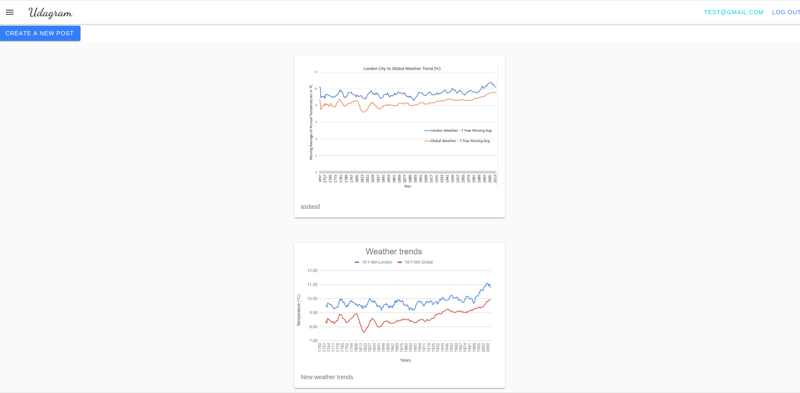
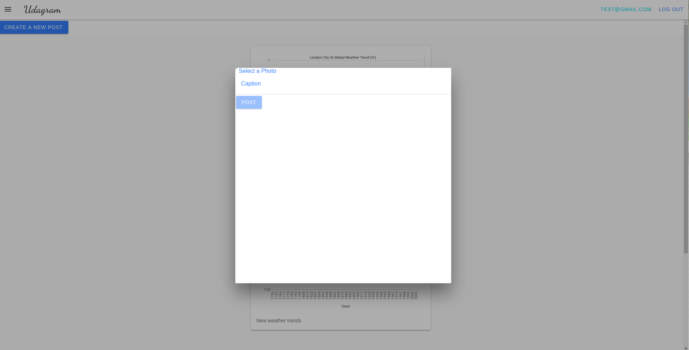
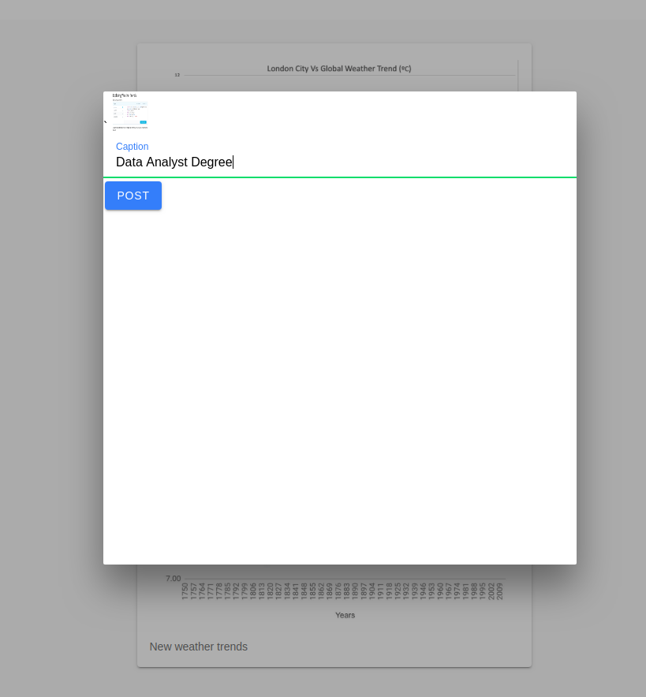
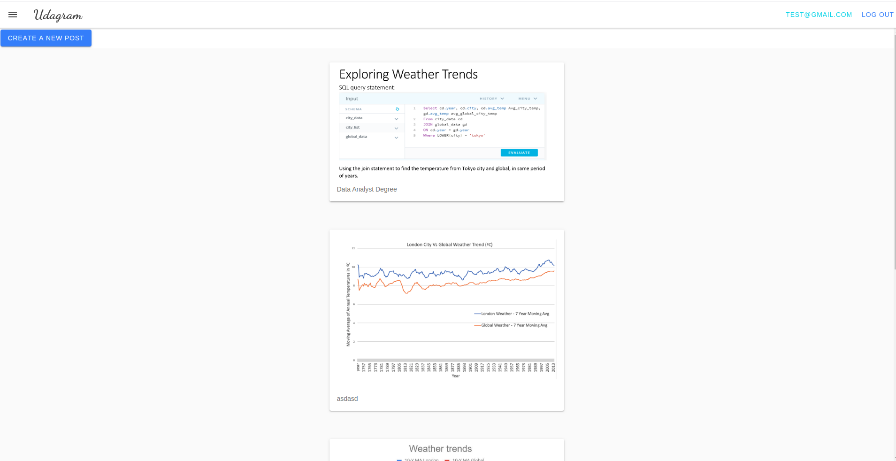
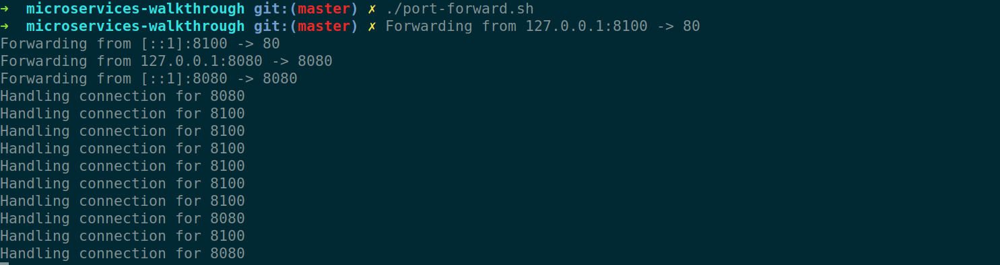
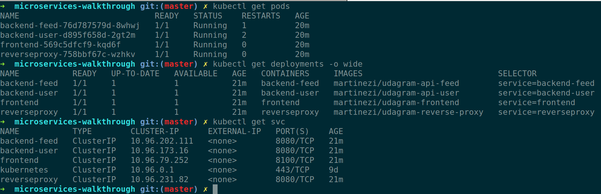

# Udagram Image Filtering Application

## Working App

- Home Screen - Logged in

- Upload Screen

- Pre Upload Screen

- Uploaded

- Console




## Project

The project is split into two parts:
1. Frontend - Angular web application built with Ionic Framework
2. Backend RESTful API - Node-Express application

* The backend API has been decomposed into two independent microservices for users and for the feed. As such, there is a bit of duplicate code across the two codebases. In real-world scenarios, this would often be done to get our microservice up and running. To clean this up, the approach would be to abstract out common code into a library such as an internal `npm` package that each project would use.

## Getting Started
> _tip_: it's recommended that you start with getting the backend API running since the frontend web application depends on the API.
### Prerequisites

You need to create a database and a s3 bucket with appropriate permissions. S3 bucket will be used to upload the images and database to track the users and their feed.

After you have created these resources, you need to set the environment variables. You can check the `udagram-deployment/docker/docker-compose.yaml` file in order to see which environment variables you need to set. 

```yaml
      POSTGRESS_USERNAME: $POSTGRESS_USERNAME
      POSTGRESS_PASSWORD: $POSTGRESS_PASSWORD
      POSTGRESS_DB: $POSTGRESS_DB
      POSTGRESS_HOST: $POSTGRESS_HOST
      AWS_REGION: $AWS_REGION
      AWS_PROFILE: $AWS_PROFILE
      AWS_BUCKET: $AWS_BUCKET
      JWT_SECRET: $JWT_SECRET
```

I have written scripts in order to ease the initial steps required. First make sure the scripts have required permissions

```bash
chmod +x ./build-image.sh ./port-forward.sh ./update_deployment.sh ./udagram-deployment/k8s/apply_deployment.sh
```

You can build the images with the build_image script(or you can use docker compose to build them).

To test it locally in containers, you can run `docker-compose up` in the udagram-deployment/docker/ folder. 


To run it locally in a cluster, you need to make sure to install minikube with virtualization software. Additionally you will need kubectl to control the cluster. Refer to the documentation on how to install these tools. Afterwards you can run  You need to expose the ports with port forwarding to your local environment the update_deployment script to apply the deployments with their respective services. 

The environment variables will be missing from the deployment as the aws-secret and configmaps for the enviornment variables are gitignored. You will need to create 3 files,

### aws_secret.yaml

```yaml
apiVersion: v1
kind: Secret
metadata:
  name: aws-secret
type: Opaque
data:
  credentials: base64_AWS_credentials
```

To get the value of the credentials

```bash
cat ~/.aws/credentials | head -3 | base64
```

This will get the first 3 lines of the credentials file which is the default aws profile and pipe to base64 to get the required value.

### env-configmap.yaml

Fill in the required values

```yaml

apiVersion: v1
kind: ConfigMap
data:
  AWS_BUCKET: 
  AWS_PROFILE: 
  AWS_REGION: 
  JWT_SECRET: 
  POSTGRESS_DB: 
  POSTGRESS_HOST: 
  URL: http://localhost:8100
metadata:
  name: env-config
```

### env-secret.yaml

```yaml
apiVersion: v1
kind: Secret
metadata:
  name: env-secret
type: Opaque
data:
  POSTGRESS_USERNAME: base64_username
  POSTGRESS_PASSWORD: base64_password
```


You can get the values easiy with 

```bash
# do not forget the n flag, otherwise there will be trailing spaces, learned my lesson the hard way.
echo -n $POSTGRESS_USERNAME | base64
echo -n $POSTGRESS_PASSWORD | base64
```

That should be enough to have your cluster working. If you have errors you can check the logs or run the describe command for the pods.

